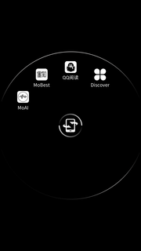

# Yota 3 ink launcher

Yota is a mobile phone with two screens each on one side. The backside has an e-ink display. Yota 2 was a well-received product which allows any app to run on either screen.

Since Yota, a Russian startup, acquired by a Chinese owner, the e-ink display is reserved for a list of applications they perceived useful, which are exclusively Chinese news apps and e-book apps. The new leadership, with a "build product, not a platform" thinking, whitelisted the apps that can run on the e-ink display. They do allow submission for inclusion to the whitelist, but the submissions go straight to the bin.

So far, the only way to use the e-ink display to run a non-whitelisted app - which includes all of the apps not exclusive to the Chinese market - is to camouflage it as a Chinese news app.

This Android project uses the same package name as 澎湃新闻 - a whitelisted app by a pro-communist party newspaper, whose readership consists of those who can only access communist news. It then launches a different app of your choice.

# Usage

Suppose the app you need to run on the e-ink display is already installed on your Android:

1. Make sure 澎湃新闻 is not installed on your mobile phone. It looks like this 

2. Go to MainActivity.java and change `com.hudway.online` to the package name of the app you need to run on the e-ink display. You might need to sift through the list of all apps installed on Android to find it. If you have adb, `adb shell 'pm list packages -f'` gives you a full list of installed apps.

3. Build the app like an ordinary Android app and install it there.

4. (Optional) Launch the newly installed app on the front screen. Check if it launches the app you need to run on the e-ink display.

5. Flip to the back of the phone and use ☰  button to launch a system menu, like this .

6. click "Discover" then 澎湃新闻.

It launches the app you configured previously.

# Todo

- Find a way to detect if the app is running on the front or back screen. If on the front, display a list of all apps installed, for the user to chose one to launch. If on the back, launches the chosen app (unless none has been chosen).
